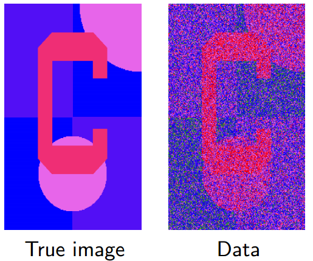
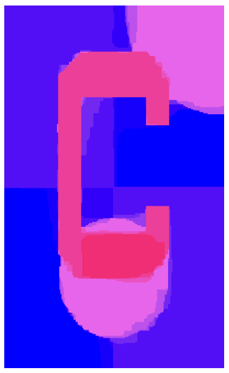
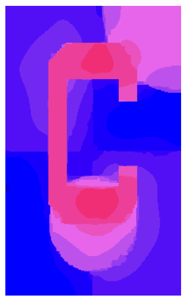
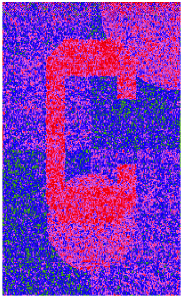

# Intro

Optimization problem is 
$$
\begin{align}
minimize & : \quad f_0(x) \\
subject ~ to & : \quad f_i(x) \le b_i, ~i = 1, ..., m
\end{align}
$$
**PS: 如何理解算法**

1. 不同的算法对同一问题的求解可能会有很大不同
2. 所谓的机器学习算法，可能更多是一个思路，比如
   1. KNN是一个对K近邻做查询的思路，可能会用到kdtree的数据结构，k-means的算法，可以用简单的KNN，或者当业务量大的时候用ANN
   2. 决策树可是一个思路，具体有ID3，C4.5和CART
   3. 随机森林也是一个思路，是bagging, 决策树, emsemble的组合。你可以用其他的emsemble的方式来进行组合，可以不用决策树而是用其他的树结构或者Map ADT，把bagging改为排序。或者说随机森林是多种思路组合起来的经过验证的特定算法
3. 机器学习算法和计算机算法的异同，其实都是算法，都是用来解决某一特定问题，但是机器学习算法融合了更多的统计学/信息论的知识，和某些特定的公式

**Example: algorithms for the 2d fused lasso**

The problem is 
$$
min_\theta \frac 1 2\sum^n_{i=1} (y_i-\theta_i)^2 + \lambda \sum_{(i, j) \in E} |\theta_i - \theta_j|
$$

The solution of Specialized ADMM, 20 iterations

The solution of proximal gradient descent 1000 iterations

The solution of coordinate descent with 10k cycles

It is quite clear that difference of different algorithms