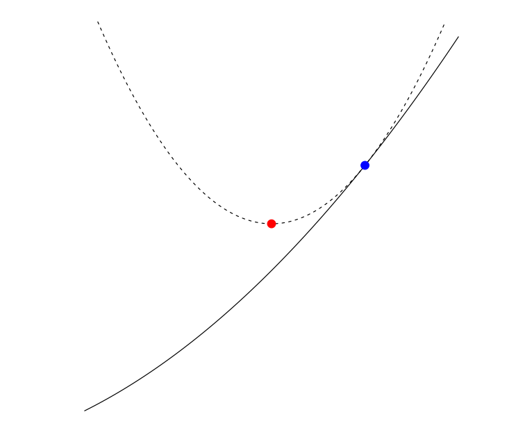

# Gradient Descent

## Unconstrained Minimization Problems

Consider **unconstrained, smooth** convex optimization
$$
min_x f(x)
$$
Gradient descent: $x^k = x^{k-1} - t_k\cdot \nabla f(x^{k-1})$

For gradient, it is the tangient line at the **blue point**. However, if we want to increase the speed of convergence, we can add an approximation of second order term (**Hessian**: $\nabla^2 f(x)$), by $\frac 1 t \mathbf I$

Hence, the **red point** is
$$
f(y) \approx f(x) + \nabla f(x)^T(y-x)+\frac 1 {2t} ||y-x||^2_2
$$
This is also the movitation of **Proximal Gradient**

## Gradient Descent & Steepest Gradient Descent

## Gradient Boost

**A version of gradient descent that is forced to work with trees**

### Trees

Given observations $y = (y_1, ..., y_n)\in \Bbb R^n$,  and then construct a weighted sum of trees for building a nonlinear model
$$
\mu_i = \sum^m_{j=1}\beta_j \cdot T_j(x_i), \qquad i = 1,..., n
$$
Pick a loss function L that reflects setting; e.g., **for continous $y$, could take $L(y_i, \mu_i) = (y_i - \mu_i)^2$**

Then to solve
$$
min_{\beta} \sum^n_{i=1}L(y_i, \sum^M_{j=1}\beta_j \cdot T_j(x_i))
$$
Indexes all trees of a fixed size, so M is huge.

In other word, thinking of optimization as $min_\mu f(\mu)$, over predicted values $\mu$, subject to $\mu$ coming from trees

### Algorithm

Starting with initial model, i.e., fitting a single tree $\mu^0 = T_0$. Repeat:

Compute negative gradient $d$ at latest prediction $\mu^{k-1}$
$$
d_i = -[\frac {\partial L(y_i, u_i)} {\partial u_i}] |_{u_i = u^{k-1}_i}, \qquad i = 1, ..., n
$$
Find a tree $T_k$ that is close to $\alpha$, i.e., according to loss
$$
min_{treeT} \sum^n_{i=1}(d_i - T(x_i))^2
$$
Compute step size $\alpha_k$, and update out prediction. Where $T_k$ is an alternatvie of gradient
$$
u^k = u^{k-1} + \alpha_k \cdot T_k
$$
Hence, the predictions are weighted sum of trees