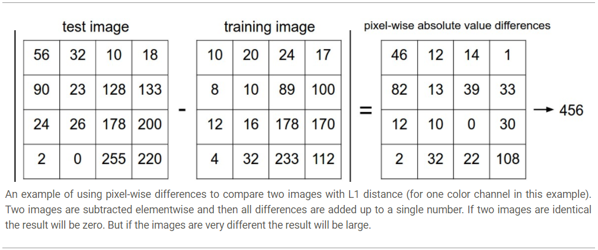
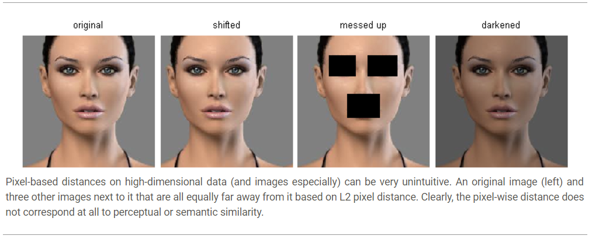

# Image Classification

## Chanllenges

* Viewpoint variation: A single instance of an object can be oriented in many ways with respect to the camera (视角变化)
* Scala variation: Visual classes often exhibit variation in their size (尺寸放缩)
* Deformation: Many objects of interest are not rigid bodies and can be deformed in extreme ways (不正常的同类图片)
* Occlusion: The objects of interest can be occluded. Sometimes only a small portion of an object could be visible (被遮挡)
* Illumination conditions: The effects of illumination are drastic on the pixel level (光影)
* Background clutter: The objects of interest may blend into their environment, making them hard to identify (与背景接近)
* Intra-class variation: The classes of interest can often be relatively broad, such as chair (同类间差异过大，比如椅子)

## Nearest Neighbor

Calculate the distance (can be L1 or L2 norm), and then find the k nearest neighbor and using the majority of class of the neighbors as prediction

**Warning:** In image, the norm is **pixel-wise**

### Pros & Cons

The pro is that the classifier takes no time to train, since all that is required is to store and possibly index the training data. However, the cons are that we pay that computational cost at test time, since classifying a test example requires a comparison to every single training example, and the distances metrics of high dimensional data is problematic. E.g., the distance of the following figures are the same. That is, the same distance or the same sum of a grouped data, may wrongly classify the images.

### Improvement

**Approximate Nearest Neighbor** algorithms allow one to trade off the correctness of the nearest neighbor retrieval with its space/time complexity during retrieval, and usually rely on a pre-processing/index stage that involves building a **kdtree**, or running the **k-means** algorithms. ([FLANN Lib](http://www.cs.ubc.ca/research/flann/))

