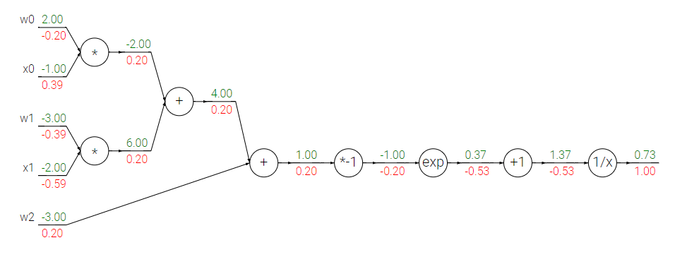

# Backpropagtion: The computational graph implementation

## Definition

For neural networks,
$$
\begin{align}
Y_n & = W_nX_{n-1}\\
X_n & = F(Y_n) \\
\end{align}
$$
where $X$ are inputs, $Y$ are outputs, and $F$ is the activation function

Using these formula, we have the backpropagation matrix
$$
\begin{align}
\frac {\partial E^p} {\partial Y_n} & = F'(Y_n)\frac {\partial E^p} {\partial X_n} \\
\frac {\partial E^p} {\partial W_n} & = X_{n-1}\frac {\partial E^p} {\partial Y_n} \\
\frac {\partial E^p} {\partial X_{n-1}} & = W^T_n \frac {\partial E^p} {\partial Y_n}
\end{align}
$$
Using gradient descent, we get update $W$ iteratively
$$
W(t) = W(t-1) - \eta \frac {\partial E} {\partial W}
$$
Two assumptions:

1. The cost function can be written as an average $E = \frac 1 n \sum_x E_x$ over cost functions $E_x$ for individual training examples, $x$
2. The cost is that can be written as a function of the outputs from the neural network

## Examples

$$
f(w, x) = \frac {1} {1 + e^{-(w_0x_0+w_1x_1+w_2)}}
$$

The forward step is quite clear

For backward step
$$
\begin{align}
\frac {\partial f} {\partial a} & = 1.00 \\
\frac {\partial f} {\partial b} &= \frac {\partial f} {\partial a} \frac {\partial a} {\partial b} =1\times -\frac 1 {x^2}= -\frac {1} {1.37^2} = -0.53 \\
\frac {\partial f} {\partial c} & = \frac {\partial f} {\partial a}  \frac {\partial a} {\partial b}  \frac {\partial b} {\partial c} = 1.00 \times {-0.53} \times 1 = -0.53\\
\cdots
\end{align}
$$

## Patterns in Backward Flow

**The add gate**: 
$$
f(x, y) = x + y \to \frac {\partial f} {\partial x} = 1, \frac {\partial f} {\partial y} = 1
$$
Hence, the error of backpropagation through add gate is not changed 

**The max gate**
$$
f(x, y) = max(x, y) \to \frac {\partial f} {\partial y} = \{1, 0\}
$$
Hence, the error of backpropagation through max gate is passed to the max input

**The multiply gate**
$$
f(x, y, z) = xyz \to \frac {\partial f} {\partial x} = yz, \frac {\partial f} {\partial y} = xz, \frac {\partial f} {\partial z} = xy 
$$

## Practical Tricks

Backpropagation can be very slow particularly for multilayered networks where the cost surface is typically non-quadratic, non-convex, and high dimensional with many local minima and/or flat regions

### Stochastic Gradient Descent (mini-batch)

Suppose we have a dataset with 1000 training samples which are repeated 10 times. Using the SGD with 100 training samples is much better than the GD. In practise, the samples are rarely duplicate, but the pattern of samples can be quite similar. **It is this redundancy that can make GD learning much slower than SGD**

**SGD introduces noise**, which leads to the gradient move over local minima or flat regions	

**Second order methods** can be added into the model, which may speed the learning process

### Shuffling the Examples

Shuffle the training set so that successive training examples never (rarely) belong to the same class. (**The distinction between shuffle and random**)

### Normalizing the Inputs

If a weight vector must change direction it can only do so by **zigzagging** which is inefficient and thus very slow.

Any shift of the average input away from zero will **bias the updates in a particular direction and thus slow down learning**

### Initializing the weights

Weights should be chosen randomly but in such a way that the sigmoid is primarily activated in its linear region. If weights are all very large then the sigmoid will saturate resulting in small gradients that make learning slow.

The advantage of appropriate weights:

1. The gradients are large enough that learning can proceed
2. The network will learn the linear part of the mapping before the more difficult nonlinear part