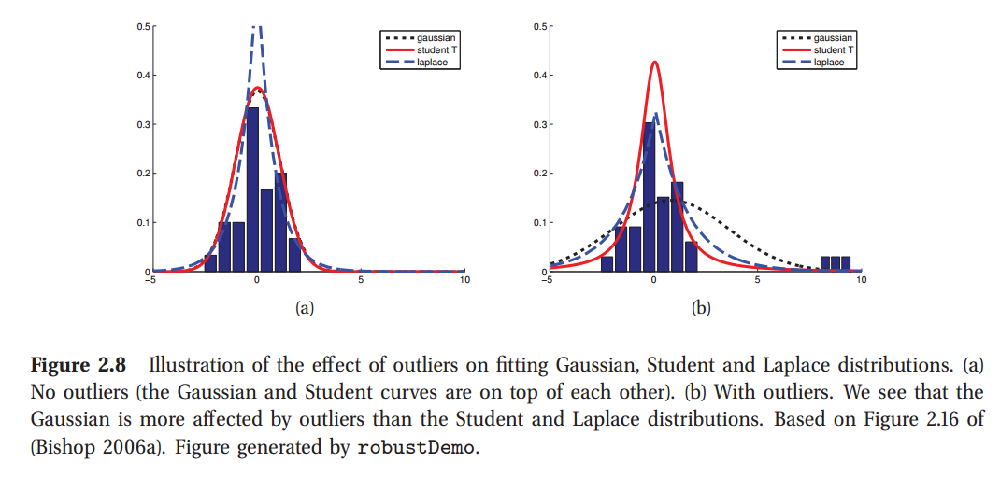
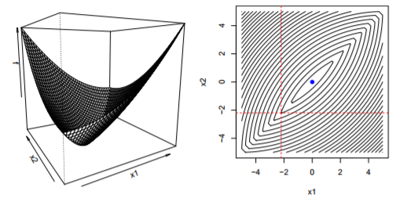

# Chap13 Sparse linear models

## Intro

We can use **mutual information** for feature selection, but this is based on a **myopic strategy that only looks at one variable at a time**. This can fail if there are interaction effects. In this chapter, we will generalize a linear model, of the form $p(y|\mathbf x) = p(y|f(\mathbf w^T\mathbf x))$ for some link function $f$. Then we can do feature selection by making the weights **sparse**.

#### The motivation

1. For high dimensional data, especially those $D > N$, feature selection can **prevent overfitting**
2. For kernel method, the resulting design matrix has size $N\times N$. Feature selection in this context is equivalent to **selecting a subset of the training examples**, which can help reduce overfitting and **computational cost**. 

## Bayesian variable selection

Suppose there exists $D$ features, then the combinations for features are $2^D$, which is impossible to compute the full posterior in general. Hence, the main topic of variable selection is **algorithmic speedups**

### Greedy

The basic ideas behind greedy algorithm are:

1. Computing argmax $p(D|\mathbf w)$
2. Evaluating its marginal likelihood $\int p(D|\mathbf w)p(\mathbf w)d\mathbf w$

Forward and backward stepwise logistic regression is using this idea

## L1 regularization: basics

#### The Laplace Distribution

$$
Lap(x|\mu, b) = \frac 1 {2b} exp(-\frac {|x-\mu|} {b})
$$

Properties:

* The mean = $\mu$, mode = $\mu$, var = $2b^2$
* It is robust to outliers
* Put more probability density at 0 than the Gaussian. This leads to encourage sparsity in a model

#### Definition

In general, the technique of **putting a zero-mean Laplace prior on the parameters and performing MAP estimation is called $L1$ regularization**. In detail, the form of prior is 
$$
p(\mathbf w|\lambda) = \prod^D_{j=1}Lap(w_j|0, 1/\lambda)\propto \prod^D_{j=1}e^{-\lambda |w_j|}
$$
Using the negative log likelihood to perform MAP estimation with this prior:
$$
f(\mathbf w) = -logp(D|\mathbf w)-logp(\mathbf w|\lambda) = NLL(\mathbf w) + \lambda ||\mathbf w||_1
$$
This can be thought of as a **convex approximation to the non-convex l_0 objective**

In the case of linear regression, the $l_1$ objective becomes
$$
f(\mathbf w) = \sum^N_{i=1} -\frac 1 {2\sigma^2}(y_i-(w_0+\mathbf w^T\mathbf x_i))^2 + \lambda ||\mathbf w||_1 = RSS(\mathbf w) + \lambda' ||\mathbf w||_1
$$
where $\lambda' = 2\lambda \sigma^2$

### Why does l1 yield sparse solution

Changing the non-smooth objective function to a smooth objective function with constrains
$$
min_{\mathbf w} RSS(\mathbf w) \qquad s.t. ||\mathbf w||_1 \le B
$$
This equation is known as **lasso**, which stands for "least absolute shrinkage and selection operator"

To solve this, we set **subgradient** of a (convex) function $f: \tau -> \Bbb R$ at a point $\theta_0$ to be a scalar $g$ such that
$$
f'(\theta) - f(\theta_0) \ge g(\theta - \theta_0) \forall\theta \in \tau
$$
where $\tau$ is some interval containing $\theta_0$. We define the **set of subderivatives** as the **interval $[a, b]$ where $a$ and $b$ are the one-sided limits**
$$
a = lim_{\theta \to \theta_0^-}\frac {f(\theta ) - f(\theta_0)} {\theta - \theta_0}, \quad b = lim_{\theta \to \theta_0^+}\frac {f(\theta ) - f(\theta_0)} {\theta - \theta_0} 
$$
The set $[a, b]$ of all subderivatives is called the **subdifferential** of the function $f$ at $\theta_0$ and is denoted $\partial f(\theta)|_{\theta_0}$. For example, in the case of the absolute value function $f(\theta) = |\theta|$, the subderivative is given by
$$
\partial f(\theta) = \begin{cases}
& \{-1\}, &\quad if ~\theta < 0\\
& [-1, 1], &\quad if ~\theta = 0\\
& \{+1\}, &\quad if ~\theta > 0
\end{cases}
$$
For lasso, we have
$$
\hat w_j(c_j) = \begin{cases}
& (c_j +\lambda) / a_j & \quad if ~ c_j <\lambda\\
& 0 & \quad if ~ c_j \in [-\lambda, \lambda]\\
& (c_j -\lambda) / a_j & \quad if ~ c_j >\lambda\\
\end{cases}
$$
where $a_j = 2\sum^n_{i=1}x^2_{ij}$ and $c_j = 2\sum^n_{i=1}x_{ij}(y_i-\mathbf w^T_{-j}\mathbf x_{i, -j})$. Hence, **for each iteration, we can get 0**, and there exists sparsity.

### Model selection

A downside of using $l_1$ regularization to select variables is that it can give quite different results if the data is perturbed sightly. A frequentist solution to this is to use **bootstrap sampling**, and to rerun the estimator on different versions of the data. This method is known as **stability selection** (PS: it should be faster than random forest). We can threshold the stability selelction probabilities at some level, say 90%, and thus derive a sparse estimator. This is known as **bootstrap lasso** or **bolasso**

## L1 regularization: algorithms

### Coordinate descent

#### Coordinatewise minimization

**This is the capstone of coordinate descent. If the condition of coordinatewise minimization is not satisfies, the answer is not optimal (not local optimal, because for convex function, local optimal is global optimal)**

**Q:** Given convex, differentiable $f : \Bbb R^n \to \Bbb R$, if we are at a point x such that $f(x)$ is minimized along each coordinate axis, then have we found a global minimizer? I.E., Does $f(x + \delta e_i) \ge f(x)$ for all $\delta, i \to f(x) = min_{z}f(z)$ (对于任何方向，任何增量，$f(x)$都是最小值?)

**A:** Yes
$$
\nabla f(x) = (\frac {\partial f} {\partial x_1}(x), ..., \frac {\partial f} {\partial x_n}(x)) = 0
$$
**Q:** Same question, but now for $f$ is convex, and not differentiable?

**A:** No. The counterpart is 

The interaction of two lines is local minimal.

**Q:** Same question, but now $f(x) = g(x) + \sum^n_{i=1} h_i(x_i)$, with g convex, differentiable and each $h_i$ convex

**A:** Yes, for any $y$
$$
f(y) - f(x) \ge \nabla g(x)^T(y-x) + \sum^n_{i=1}[h_i(y_i) - h_i(x_i)] = \sum^n_{i=1}[\nabla_ig(x)(y_i-x_i) + h_i(y_i) - h_i(x_i)] \ge 0
$$

#### Algorithm

$$
\begin{align}
x^k_1 & \in argmin_{x_1} f(x_1, x^{k-1}_2, ..., x^{k-1}_n) \\
x^k_2 & \in argmin_{x_2} f(x^{k-1}_1, x_2, ..., x^{k-1}_n) \\
\cdots\\
x^k_n & \in argmin_{x_1} f(x^{k-1}_1, x^{k-1}_2, ..., x_n)
\end{align}
$$

Notes:

1. **Order of cycle through coordinates is arbitrary**, can use any permutation of $\{1, 2, ..., n\}$
2. Can everywhere **replace individual coordinates with blocks of coordinates**. **This leads to SMO**
3. **One-at-a-time** update scheme is critical. This leads to the **parallel is not usable**
4. Coordinate descent is not **first order method**, so it can be faster than **accelerated gradient descent**

### LARS

### Proximal and gradient projection methods

## L1 regularization: extensions

### Group lasso

#### Model

In standard regularization, we assume that there is a $1:1$ correspondence between parameters and variables, so that if $\hat w_j = 0$, we interpret this to mean that variable $j$ is excluded. But in more complex models, there may be **many parameters associated with a given variable**. E.g,  using one-hot encoding into a vector.

Mathemtically, we partition the parameter vector into $G$ groups. Then to minimize
$$
J(\mathbf w) = NLL(\mathbf w) + \sum^G_{g=1} \lambda_g ||\mathbf w_g||_2
$$
where $||\mathbf w_g||_2$ is the 2-norm of the group weight vector. We often use a larger penalty for larger groups, by setting $\lambda_g = \lambda \sqrt d_g$. If we use the squared 2-norm, we get a ridge. E.g.,
$$
J(\mathbf w) = NLL(\mathbf w) + \lambda [\sqrt 2 \sqrt{w_1^2 + w_2^2} + \sqrt 3 \sqrt {w_3^2+w_4^2+w_5^2}]
$$
Or, we can replace the 2-norm with the infinity-norm
$$
||\mathbf w_g||_{\infty} = max_{j\in g} |w_j|
$$
And **this $l_\infty$ norm has a tendency to make all the elements within a block to have similar magnitude**.

#### Algorithm

### Fused lasso

## Automatic relevance determination / sparse Bayesian learning