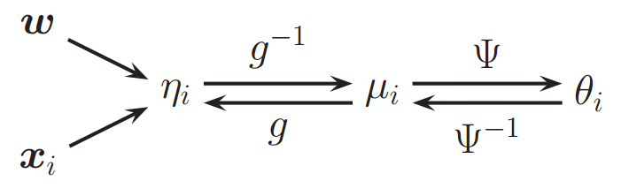

# Chap9 Generalized Linear Models and the Exponential Family

## The Exponenital Family

1. Under certain regularity conditions, the exponential family is **the only family of distributions with finite-sized sufficient statistics**, meaning that we can compress the data into a fixed-sized summary without loss of information
2. **The only family of distributions for which conjugate priors exist**, which simplifies the computation of the posterior
3. The family of distributions that makes the **least set of assumptions subject to some user-chosen constraints**
4. At the core of generalized linear models
5. At the core of variational inference

### Sufficiency

> Let $X_1$, ..., $X_n$ be a random sample from a probability distribution with unknown parameter $\theta$. Then, the statistic $Y = u(X_1, ..., X_n)$ is said to be **sufficient** for $\theta$ if the conditional distribution of $X_1, ..., X_n$ given the statistic Y, does not depend on the parameter $\theta$

Example: 

Consider a random sample $X_1, ..., X_n$ of size n, from the Bernouli distribution with $P(x = 0) = 1- p$. The parameter is the population  proportion p. **Show that $T = \sum^n_{i=1}X_i$ is a sufficient statistic**

Solution:

By independence, the joint distribution of the random sample is 
$$
\prod^n_{i=1}p^{x_i}(1-p)^{1-x_i} = p^{\sum^n_{i=1}x_i}(1-p)^{n-\sum^n_{i=1}x_i}
$$
and then the joint probability of $X_1= x_1, ..., X_n = x_n$ and $T = \sum^n_{i=1}X_i=t$ is
$$
f(x_1, x_2, ..., x_n, t; p) = p^t(1-p)^{(n-t)} \qquad where \sum^n_{i=1} x_i = t
$$
and is zero elsewhere. Further, $T = \sum^n_{i=1}X_i$ has the binomial distribution
$$
g(t; p) = \binom {n} {t}p^t(1-p)^{n-t} \qquad for ~t = 0, 1, ..., n
$$
Consequently, the conditional distribution of the sample, given $T=t$ is 
$$
f(x_1, x_2, ..., x_n|T=t, p) = \frac {f(x_1, x_2, ..., x_n, t; p)} {g(t; p)} = \frac {p^t(1-p)^{(n-t)} } {\binom {n} {t}p^t(1-p)^{n-t}} = \frac {1} {\binom n t}
$$
which **does not depend on the parameter $p$**. Hence,   $T = \sum^n_{i=1}X_i$ is a sufficient statistic.

**PS: 性质1的意思是说，指数族的一些统计量，不会受分布参数的影响，但会受分布的影响**

### Definition

A pdf or pmf $p(\mathbf x | \theta)$, for $\mathbf x = (x_1, ..., x_m) \in\chi^m$ and $\theta \in \Theta \subseteq \Bbb R^d$, is said to be in the **exponential family** if it is the form 
$$
\begin{align} P(\mathbf x | \theta) & = \frac {1} {Z(\theta)}h(\mathbf x)exp[\theta^T\phi(\mathbf x)] \\
& = h(\mathbf x)exp[\theta^T\phi(\mathbf x)-A(\theta)]
\end{align}
$$
where
$$
\begin{align}
Z(\theta) & = \int h(\mathbf x)exp[\theta^T\phi(\mathbf x)]d\mathbf x \\
A(\theta) & = logZ(\theta)
\end{align}
$$

* $\theta$ are called the **natural parameters** or **canonical parameters**
* $\phi(\mathbf x) \in \Bbb R^d$ is called a vector of **sufficient statistics**
* $Z(\theta)$ is called the **partition function**
* $A(\theta)$ is called the **log partition function** or **cumulant function**
* $h(\mathbf x)$ is the a **scaling constant**, often 1

### Bernoulli

$$
Ber(x|\mu) = \mu^x(1-\mu)^{1-x} = exp[xlog(\mu)+(1-x)log(1-\mu)] = exp[\phi(x)^T\theta]
$$

where $\phi(x)=[\Bbb I(x=0), \Bbb I(x=1)]$ and $\theta = [log(\mu), log(1-\mu)]$
$$
Ber(x|\mu) = exp[xlog(\mu)+(1-x)log(1-\mu)] = exp[xlog(\mu)+log(1-\mu)-xlog(1-\mu)] = (1-u)exp[xlog \frac \mu {1-\mu}]
$$
hence $\phi(x) = x$, $\theta = log(\frac \mu {1-\mu})$, which is **log-odds ratio**, and $Z = 1/(1-\mu)$, $A = -log(1-\mu)$

We can recover the mean parameter $\mu$ from the canonical parameter using 
$$
\mu = sigm(\theta) = \frac 1 {1 + e^{-\theta}}
$$
PS: 这里的$x$是建模时的$y$, $\mu$是统计学的$p$，也就是比如，样本中是1概率，然后利用这个概率的得到$\theta$，$\theta$是对样本概率进行某种函数转换的结果

### Log partition function

An important property of the exponential family is that derivatives of the log partition function can bse used to generate **cumulants** of the sufficient statistics.

> The **cumulants** of a probability distribution are a set of quantitiles that provide an **alternative to the moments of the distribution**.

PS: **利用$A(\theta)$得到不同的moments**
$$
\begin{align}
\frac {dA} {d\theta} & = E[\phi(x)] \\
\frac {d^2A} {d\theta^2} & = var[\phi(x)]\\
\end{align}
$$
In Bernoulli distribution, $A(\theta) = -log(1-\mu) = log(1+e^\theta)$, so the mean is given by
$$
\frac {dA} {d\theta} = \frac {e^\theta} {1+e^\theta} = \mu
$$
The variance is given by
$$
\frac {d^2A} {d\theta^2} = \frac d {d\theta}(1+e^{-\theta})^{-1} = (1 + e^{-\theta})^{-2}\cdot e^{-\theta} = \frac 1 {1+e^\theta} \frac {1} {1+e^{-\theta}} = (1-\mu)\mu
$$
**Note: $A(\theta)$ is a convex function**

### MLE for Canonical exponential family

**PS: 为什么用MLE求Logistic regression的解，是最优解？**

Given N iid data points $D = (x_1, ..., x_N)$, for canonical exponential family, the likelihood is 
$$
\begin{align}
p(D|\theta) & = \prod^N_{i=1}h(\mathbf x_i)exp([\theta^T\phi(\mathbf x_i) - A(\theta)])  \\
log (p(D|\theta)) & = \theta^T\phi(D) - NA(\theta)
\end{align}
$$
**Since $-A(\theta)$ is concave in $\theta$, and $\theta^T\phi(D)$ is linear in $\theta$, we see that the log likelihood is concave, and hence has a unique global maximum**

**Furthermore, the negitive log likelihood function is concave**

### Maximum Entropy

The principle of **maximum entropy** or **maxent** says **we should pick the distribution with maximum entropy (closest to uniform), subject to the constraints that the moments of the distribution match the empirical moments of the specified functions**

> Subject to precisely stated prior data (such as a proposition that express testable information), the probability distribution which best represents the current state of knowledge is the one with largest entropy
>
> 对一个随机事件的概率分布进行预测时，预测应当满足全部已知条件。在这种情况下，概率分布 最均匀（熵越大），预测的风险最小

**The maxent distribution $p(\mathbf x)$ has the form of the exponential family**. 
$$
\begin{align}
p(\mathbf x) & = \frac 1 Z exp(-\sum_k\lambda_kf_k(\mathbf x))\\
subject ~ to \quad Z & = \sum_xexp(-\sum_k\lambda_kf_k(\mathbf x))
\end{align}
$$
where $Z=e^{1+\lambda_0}$, $\lambda_k$是$k$个moment的拉格朗日系数, $\lambda_0$是特殊系数, $f_k(\mathbf x)$是任意的方程。

**Bernoulli满足这个条件，因此可以用maxent来求解**

PS: 需要证明，exponential family满足maxent的约束；和性质3

## Generalized Linear Models

### Basics

Generalized linear models are those models in which the **output density is in the exponential family**, and in which the **mean parameters are a linear combination of the inputs, passed through a possibly nonlinear function**, such as logistic function
$$
p(y_i|\theta, \sigma^2) = exp[\frac {y_i\theta - A(\theta)} {\sigma^2} + c(y_i, \sigma^2)]
$$

* $\sigma^2$ is the **dispersion parameter** (often set to 1)
* $\theta$ is the natural parameter
* $A$ is the partition function
* $c$ is a normalization constant

* To convert from the mean parameter to the natural parameter we can use a function $\psi$. This function is **uniquely determined by the form of the emponential family distribution** 
* $g^{-1}$ is the **mean function**, which **makes the mean of the distribution be some invertible monotonic function of this linear combination** ($\eta_i = \mathbf w^T \mathbf x_i$)
* The inverse of the mean function, is called the **link function**. We are **free to choose almost any function we like for $g$**, so long as it is **invertible**, and so long as $g^{-1}$ **has the appropriate range**
* One particularly simple form of link function is to use $g = \psi$, this is called **canonical link function**. E.g., for the Bernoulli/binomial distribution, the canonical link is the **logit function**; $g(\mu) = log (\eta/(1-\eta))$, whose inverse is the logistic function

| Distrib.           | Link g($\mu$) | $\theta = \psi(\mu)$              | $\mu = \psi^{-1}(\theta) = \Bbb E[y]$ |
| ------------------ | ------------- | --------------------------------- | ------------------------------------- |
| $N(\mu, \sigma^2)$ | identity      | $\theta = \mu$                    | $\mu = \theta$                        |
| $Bin(N, \,u)$      | logit         | $\theta = log(\frac \mu {1-\mu})$ | $\mu = sigm(\theta)$                  |
| $Poi(\mu)$         | log           | $\theta = log(\mu)$               | $\mu = e^{\theta}$                    |

Going back to the defination of GLM, *the mean parameters are a linear combination of the inputs, passed through a possibly nonlinear function*, we find:

* linear combination: $\eta_i = \mathbf w^T \mathbf x_i$
* nonlinear function: **mean function**, $\mu_i = g^{-1}(\eta_i) = g^{-1}(\mathbf w^T\mathbf x_i)$

---

For **ReLU**, which satisfies the definition of GLM, the mean function is $max(0, \mathbf w^T \mathbf x_i)$. Hence the link function is
$$
f(x) =
\begin{cases}
& \frac 1 2 (\mathbf w^T \mathbf x_i)^2 & \quad x > 0\\
& C & \quad x \le 0
\end{cases}
$$

---

### ML and MAP estimation

One of the appealing properties of GLMs is that they can be fit using exactly the same methods that we used to fit logistic regression. In particular, the log-likelihood has the following form:
$$
l(\mathbf w) = log p(D|\mathbf w) = \frac 1 {\sigma^2} \sum^N_{i=1}\theta_iy_i - A(\theta_i)
$$
If we use a canonical link, $\theta_i = \eta_i$, this simplifies to 
$$
\nabla_{\mathbf w} l (\mathbf w) = \frac 1 {\sigma^2}[\sum^N_{i=1}(y_i - \mu_i)\mathbf x_i]
$$
Hence we can use stochastic gradient descent. However, for improved efficiency, we should use a **second-order method**. For a canonical link, the Hessian is given by
$$
\mathbf H = -\frac 1 {\sigma^2} \sum^N_{i=1} \frac {d\mu_i} {d\theta_i} \mathbf x_i\mathbf x_i^T = -\frac 1 {\sigma^2} \mathbf X^T\mathbf S \mathbf X
$$
where $\mathbf S = diag(\frac {d\mu_1} {d\theta_1}, ..., \frac {d\mu_N} {d\theta_N})$ is a diagonal weighting matrix. This can be used inside the **IRLS** algorithm

## Probit Regressions

---

**How to get an appropriate S-shape curve with different mean function ? **

In general, we can write $p(y=1|\mathbf x_i, \mathbf w) = g^{-1}(\mathbf w^T\mathbf x_i)$, for any function $g^{-1}$ that maps $[-\infty, \infty]$ to $[0, 1]$. Several possible mean function are

| Name                  | Formula                                  |
| --------------------- | ---------------------------------------- |
| Logistic              | $g^{-1}(\eta) = sigm(\eta) = \frac {e^\eta} {1+e^\eta}$ |
| Probit                | $g^{-1}(\eta) = \Phi(\eta)$              |
| Log-log               | $g^{-1}(\eta) =exp(-exp(-\eta))$         |
| Complementary Log-log | $g^{-1}(\eta) =1 - exp(-exp(\eta))$      |

---

The mean function of probit regression is $g^{-1}(\eta) = \Phi(\eta)$, where $\Phi(\eta)$ is the cdf of the standard normal.

**Note: ** The Gaussian noise term is zero mean and unit variance is made without loss of generality. The reasion is that we could easily rescale $\mathbf w$ and add an offset term without changing the likelihood, since 
$$
P(N(0, 1)\ge -\mathbf w^T\mathbf x) = P(N(\mu, \sigma^2) \ge -(\mathbf w^T\mathbf x + \mu) / \sigma)
$$
